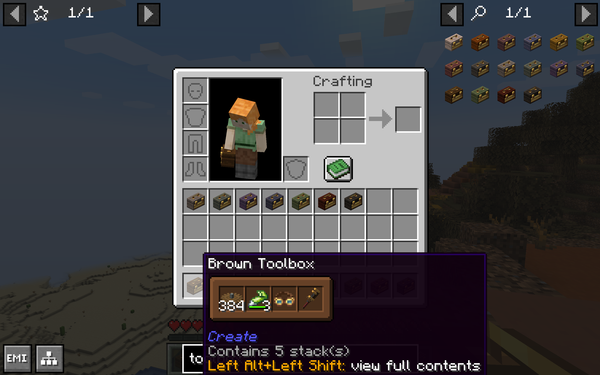
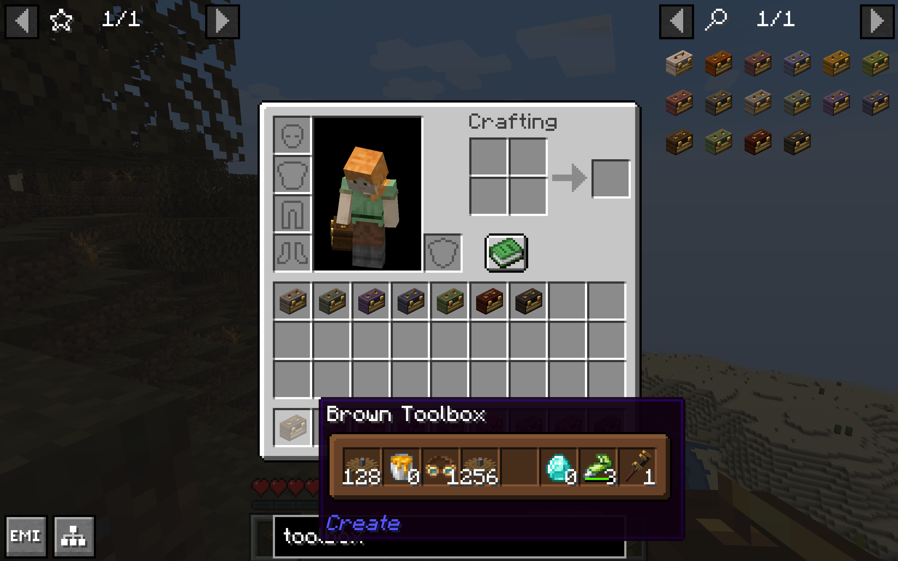

# Create Toolbox Tooltip

 
 

This addon mod shows a tooltip which displays the contents of Create toolboxes when hovering over them in your inventory.

 

 

This mod was made using the Shulker Box Tooltip API. You can edit its configurations under the Shulker Box Tooltip mod's config in Mod Menu (on Quilt/Fabric, you will need to have Mod Menu installed first). Check out their [Wiki](https://github.com/MisterPeModder/ShulkerBoxTooltip/wiki) and [Modrinth](https://modrinth.com/mod/shulkerboxtooltip) page for more info.

Big thanks to the creators of Shulker Box Tooltip for making this mod a possibility!

## Features:

(Basically) everything that Shulker Box Tooltip gives you for Shulker Boxes except for toolboxes including GUI color customization.

 

Displays empty item stacks.

### Coming Soon:

-   Support for other versions of Minecraft
-   Ability to toggle on/off Create's default tooltip for toolboxes

## Dependencies:

-   [Create](https://modrinth.com/mod/create-fabric/versions?g=1.20.1) (and all its dependencies)
-   [Shulker Box Tooltip v4.0.4](https://modrinth.com/mod/shulkerboxtooltip/versions?g=1.20.1) (and all its dependencies)

### Recommended:

-   [Mod Menu](https://modrinth.com/mod/modmenu) (On Quilt/Fabric)

#### License

Copyright © 2026, Sylvie Lee. Licensed under the [MIT License](LICENSE).
